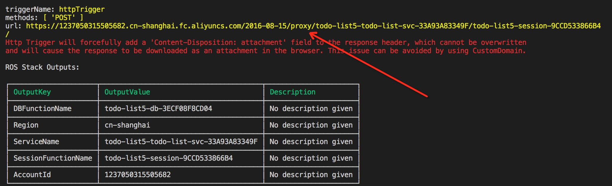
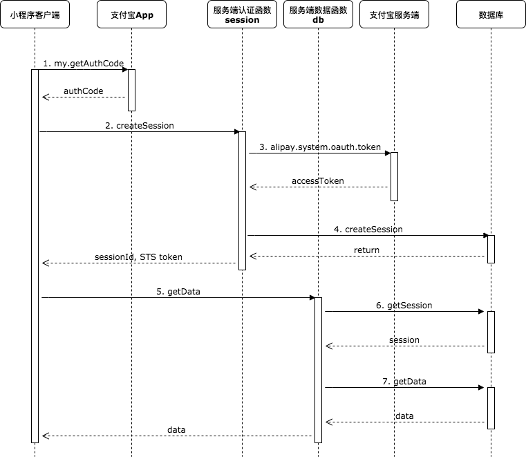

# TODO List Miniapp Service

基于[函数计算](http://fc.console.aliyun.com/)和[表格存储](http://ots.console.aliyun.com/)的小程序服务端模板，解决了身份认证和数据访问等通用问题，让开发者能够专注在业务逻辑上，快速开发上线自己的小程序。这个模板具有以下特点：

1. 运维效率高: 无需管理服务器，部署函数即可上线
2. 开发效率高: 基于封装好的数据接口，直接开发业务代码
3. 0费用启动: 服务端基于函数计算，数据库采用表格存储，都是按量付费并且还有较大的免费额度

## 使用方法

使用者需要拥有阿里云账号并且开通了函数计算、表格存储、日志服务和访问控制这些服务。在使用模板部署之前，需要准备如下参数：

|资源|必选|说明|
|----|----|----|
|tablestore instance name|是|表格存储实例名，全局唯一，填写自己的实例名称|
|log project name|是|日志服务的项目名，全局唯一，填写自己的项目名称|
|app id|是|支付宝小程序的APP ID|
|private_key.pem|是|支付宝小程序生成的私钥，放置在`./session/private_key.pem`|

填写完成后，使用[fun工具](https://github.com/alibaba/funcraft)进行部署：

```sh
git clone https://github.com/awesome-fc/fc-mini-app-server.git
cd mini-app-todo-list-server
IGNORE_TPL_VALIDATION=true fun install
fun package
fun deploy --use-ros --stack-name todo-list4 -p AppId=2021001106651001 -p DBInstanceName=todo-list-db4 -p LogProjectName=todo-list-log4 -p RoleNamePrefix=todo-list4
```

部署成功后，会生成一个session的URL:



可以测试一下是否部署成功：

```sh
$ curl -X POST https://1237050315505682.cn-shanghai.fc.aliyuncs.com/2016-08-15/proxy/todo-list-svc/session/ -d '{}' && echo
Error: authCode required
```

如果收到"authCode required"，则表明部署成功。

部署成功后，会输出5个参数(AccountId, Region, ServiceName, SessionFunctionName, DBFunctionName)，把它们配置在[小程序客户端项目](https://github.com/awesome-fc/fc-mini-app-client)中，客户端就能访问我们部署的服务了。

### 关于日志

由于日志服务的LogProject在创建后立即访问会出现"log project not exist"的错误，所以在ROS模板中FC的Service没有设置LogConfig。模板中仍然创建了相关的日志服务资源，用户可以在部署成功后手动在FC控制台设置一下日志。

## 实现原理

客户端和服务端的交互流程如下：



其中1-4步只需要在首次认证的时间执行，5-7步是后续访问数据的时候执行。

数据表结构:

|uid(pk)|id(pk)|col1   |col2  |col3     |...      |
|-------|------|-------|------|---------|---------|
|uid1   |id1   |val11  |val12 |val13    |...      |
|uid1   |id2   |val21  |val22 |val23    |...      |
|uid2   |id3   |val31  |val32 |val33    |...      |

Session表结构:

|id(pk) |userId |col2  |col3     |...      |
|-------|-------|------|---------|---------|
|sid1   |uid1   |val12 |val13    |...      |
|sid2   |uid2   |val22 |val23    |...      |
|sid3   |uid3   |val32 |val33    |...      |

## 问题反馈

- https://help.aliyun.com/document_detail/53087.html
